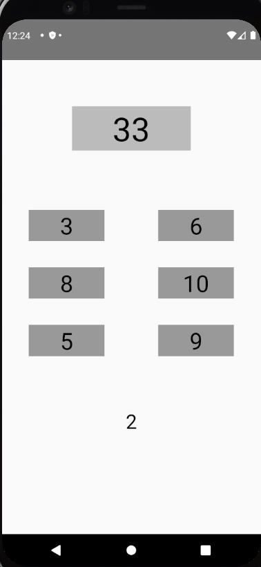
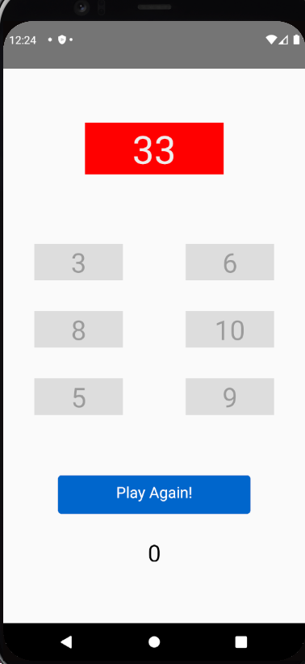
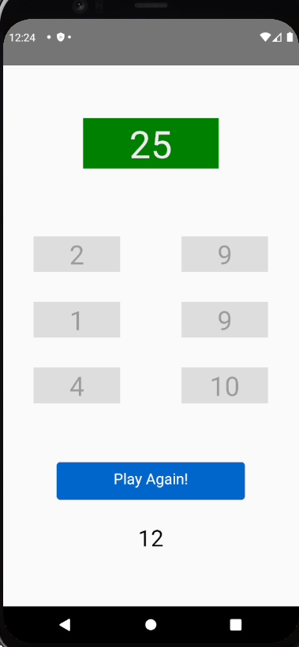

# Target Sum

### A React Native game to obtain the target sum using the listed numbers.

 

## Initial Screen

This is the image of the screen when the game is opened:

 

## Lose Case

If one cannot obtain the some correctly in the time interval, the target sum's color will become red, the timer will be cleared and the play again button will be displayed:

 

## Win Case

If the sum is obtained correctly, the target sum's color will become green, the timer will be cleared and the play again button will be displayed:

